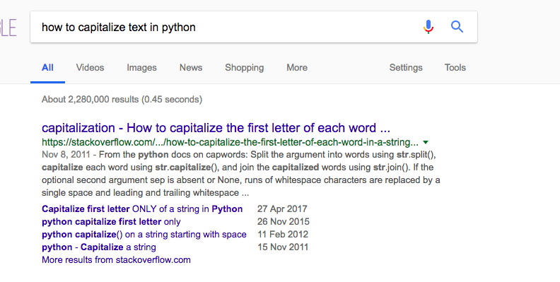
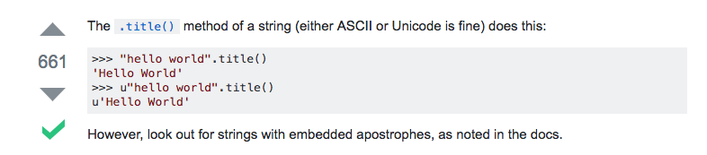

# Why use code

## Let's go!

As you have seen from the **Instant Data Science** lesson, programming is a powerful tool for answering questions about data.  It allows us to collect data, clean up and format our data, and then perform calculations on that data.  

Much of our digital information is in the form of text.  Song lyrics, or emails, for example.  And to clean up and format that text with Python, we need to become familiar with our first type of data, the string.

### Objectives
* Working with our first data type, strings
* Learning about string methods that Python provides us
* Learning how to discover new methods

## Working with text

A lot of information in the world is in the form of text.  And if we want to capture this information, and operate on it we should become familiar with an entire datatype in Python dedicated to it: the string.


```python
'Homer Simpson'
```


    'Homer Simpson'


When programmers say "string", what they mean is text.  When programmers say datatype, they just mean type of data.  For example, here is another datatype in Python, a number.


```python
3
```


    3


We can discover the type of a piece of data by calling the `type` method.


```python
type('Homer Simpson')
```


    str


We pay attention to what type of data we are working with because they operate differently.

For example, to initialize a string we cannot simply type letters.  Instead, we need to be very explicit with Python and tell Python it is about to see some text.  We do this by surrounding our text with quotes.  If we don't do that, or end our quotation marks too early, Python will throw us an error.


```python
'Homer Simps'on
```


      File "<ipython-input-35-cfe60ad2684c>", line 1
        'Homer Simps'on
                      ^
    SyntaxError: invalid syntax


If you want, you can also use double quotes.


```python
"Homer don't care"
```


    "Homer don't care"


## Changing data with built in methods

The reason Python is so picky is because, once it knows we are working with a string, it gives us different functionality for operating on strings.  We call this functionality a function, or a method.

For example here is a method that works with a string (text), but does not work with a number.


```python
'Homer Simpson'.upper()
```


    'HOMER SIMPSON'


```python
42.upper()
```


      File "<ipython-input-17-ade3a24a9923>", line 1
        42.upper()
               ^
    SyntaxError: invalid syntax


Yep.  Bad news bears.

We can operate on a datatype with the following format:

* datatype
* dot
* method name
* parentheses

Here's another example. And as you can see, it follows the same format.


```python
"Homer Simpson".endswith('Simpson')
```


    True


```python
"Charles Montgomery Burns".endswith('Simpson')
```


    False


So as you can see, by following the format of data-dot-method name-parentheses we can begin to operate on our data.

###  Discovering new methods

You may be starting to worry about there being too many methods to keep track of.  Let's ask Python for help with finding more information about what we can do with strings.


```python
help('strings')
```

    No Python documentation found for 'strings'.
    Use help() to get the interactive help utility.
    Use help(str) for help on the str class.


The `help()` word with Python comes out of the box with the language, and is like an old school Alexa.  And just like Alexa, it often doesn't understand us.  Let's follow it's stern directions, and see what happens when we type in `help(str)`.


```python
help(str)
```

    Help on class str in module builtins:

    class str(object)
     |  str(object='') -> str
     |  str(bytes_or_buffer[, encoding[, errors]]) -> str
     |  
     |  Create a new string object from the given object. If encoding or
     |  errors is specified, then the object must expose a data buffer
     |  that will be decoded using the given encoding and error handler.
     |  Otherwise, returns the result of object.__str__() (if defined)
     |  or repr(object).
     |  encoding defaults to sys.getdefaultencoding().
     |  errors defaults to 'strict'.
     |  
     |  Methods defined here:
     |  
     |  __str__(self, /)
     |      Return str(self).
     |  
     |  capitalize(...)
     |      S.capitalize() -> str
     |      
     |      Return a capitalized version of S, i.e. make the first character
     |      have upper case and the rest lower case.
     |  
     |  casefold(...)
     |      S.casefold() -> str
     |      
     |      Return a version of S suitable for caseless comparisons.
     |  
...


Holy cow that's a lot of words.  If we scroll down to the word capitalize, things begin to make more sense.  For example, for capitalize, this is what it says


capitalize(...)

    S.capitalize() -> str
    Return a capitalized version of S, i.e. make the first character
    have upper case and the rest lower case.

Our next step is to use our formula of datatype-dot-method name-parentheses, and see what happens next.


```python
"smithers".capitalize()
```


    'Smithers'


Excellent.  Just like we thought.

### Tips going forward

That's really it for this lesson on strings, and it's easy to feel a little unsatisfied with just a few methods on the datatype.  What's more important with programming is mechanisms of discovery and experimentation beyond just memorizing a list of features.

In this lesson, we already saw a few of them.  
* Guess: We just tried something and looked to the error message for clues as to what to do next.
* help(str): We saw a nice way to learn about new methods, then we took a guess to test our understanding
* Following a pattern: We started with a simple method like calling upper, took a moment to break this down into a pattern, and then tried this pattern again to call other methods

Here is one more.  Just ask Google.  For example, look what happens when we ask Google about capitalization.



A great link with a detailed answer.



Then we try this new method out ourselves, to see if this user on StackOverFlow is right (they normally are).


```python
"hello world".title()
```


    'Hello World'


And our work is done.

### Summary

In this lesson, we learned about our first datatype in Python: strings.  A string is just text.  And we indicate to Python that we are writing a string by surrounding our content with quotation marks.  Once we do this, we can operate on this string by calling methods like `upper` or `endswith`.  We identified a general pattern for calling methods on datatypes: 'datatype-method name-dot-parentheses'.

The second thing we learned was different mechanisms for learning about methods.  We saw the importance of guessing and experimentation, and how doing so can give us error messages, which provide clues. We also saw how to ask questions about a datatype by calling 'help' followed by the datatype name like `help(str)`.  Finally, we saw we can ask Google.  This mechanism of exploration is a skill we'll build up over time and this course will provide guidance and practice on along the way.
